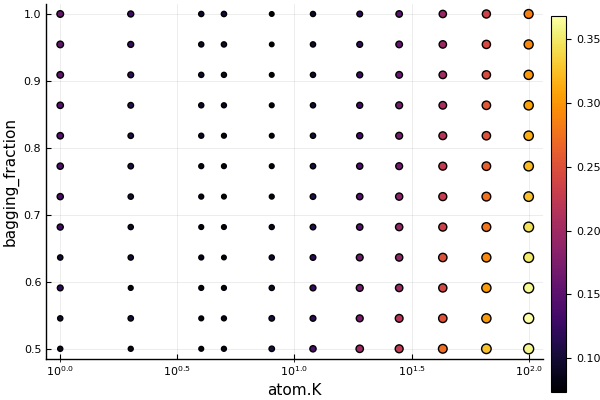

### Tuning code excerpt

#### A composite model
```julia
> knn_model=KNNRegressor(K=10)
> ensemble_model = EnsembleModel(atom=knn_model, n=20)
> params(ensemble_model)

(atom = (target_type = Float64, K = 20, metric = MLJ.KNN.euclidean, 
         kernel = MLJ.KNN.reciprocal), 
		 weights = Float64[], bagging_fraction = 0.8, rng_seed = 0, n = 20, 
		 parallel = true)
```

##### Constructing a grid

```julia
> B_range = range(ensemble_model, :bagging_fraction, 
                       lower= 0.5, upper=1.0, scale = :linear)
> K_range = range(knn_model, :K, lower=1, upper=100, scale=:log10)
> nested_ranges = (atom = (K = K_range,), bagging_fraction = B_range)
```

##### Tuning

```julia
> tuning = Grid(resolution=12)
> resampling = Holdout(fraction_train=0.8)
> tuned_ensemble_model = TunedModel(model=ensemble_model, 
    tuning=tuning, resampling=resampling, nested_ranges=nested_ranges, measure=rms)

> tuned_ensemble = machine(tuned_ensemble_model, X[train,:], y[train])
> fit!(tuned_ensemble)
> plot(tuned_ensemble)
```



